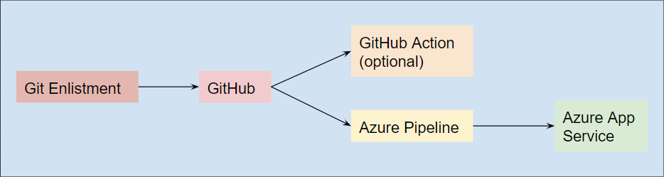
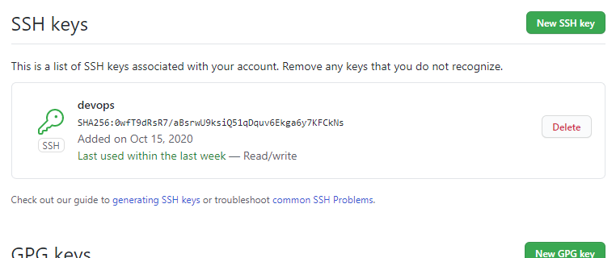
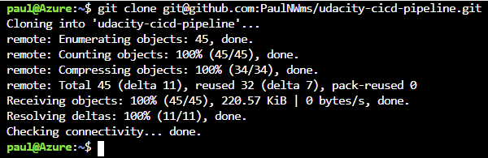
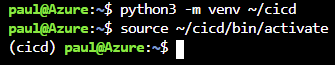
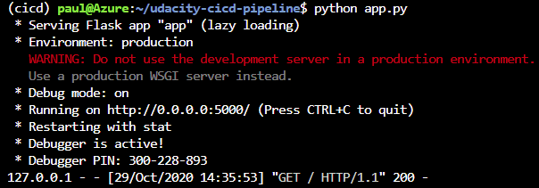
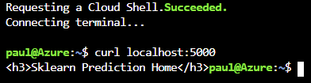
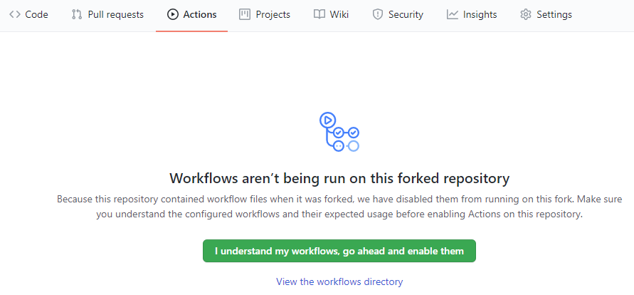
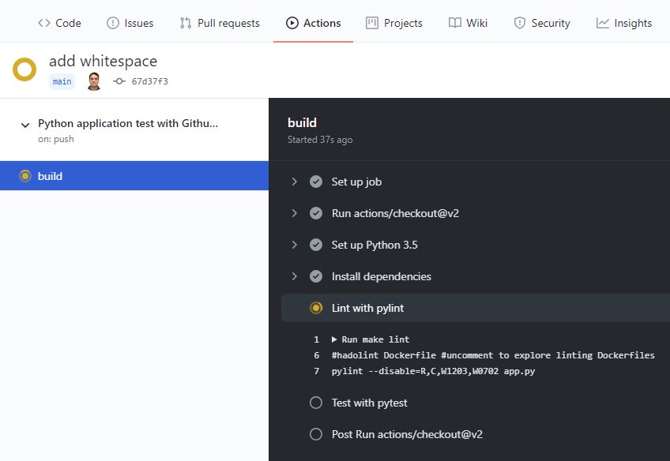
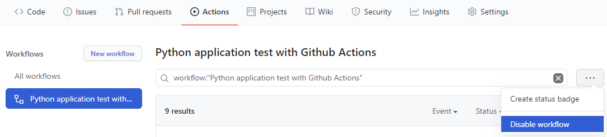

# Overview


~~<TODO: complete this with an overview of your project>~~

This project is a template implementation of a devops CI/CD pipeline.  Upon code checkin, the project is linted, built and API tested.  If all these are successful, a service is deployed to a live server.  The target server could be in a dev, staging or production environment.

A sample flask service is provided.  This is a placeholder; the intention is to replace it with your own microservice.

The code is stored in a GitHub repository.  Azure Pipelines is used to build the project, which hooks into Azure App Services for deployment.

## Project Plan

This project was done in the context of agile methods.  A CI/CD pipeline can be used with any project methodology, but agile relies on rapid, if not continuous, delivery to market (hence the name).

To start things off, a quick look ahead at the course contents and project requirements was done.  From this, milestones and time estimates were made, and a rough plan in [Google docs](https://docs.google.com/spreadsheets/d/1MzGub0FddyPmF_IfvbL_cvbgdg01KYJ0uMRwSX69rHM/edit#gid=1348135932) was created.

A [Trello](https://trello.com/b/ySyI22ET/ci-cd-pipeline) board was created and tickets corresponding to the milestones were made.  The tickets are more detailed and (hopefully) broken down into ~4-hour jobs.  Of course these are just estimates, the actual time required can vary greatly.

(**Note to grader:** the Trello board was left in an incomplete state.  It's not much to look at if everything's in the _Done_ column...)


~~<TODO: Project Plan~~

* ~~A link to a Trello board for the project~~

* ~~A link to a spreadsheet that includes the original and final project plan>~~

As mentioned in lecture, the management process overhead should be right-sized for the project.  But in this case, part of the assignment is the application of agile methods, so it's a bit process-heavy by design.

## Instructions

The CI/CD pipeline involves multiple accounts working in concert.  Some manual setup is required.

Prerequisites:
- [GitHub](https://github.com/) account
- [Azure](https://portal.azure.com/) account
- [Azure DevOps](https://dev.azure.com/) account
- basic familiarity with all 3 environments

This CI/CD pipeline exists entirely in GitHub and Azure, so there is no need to clone the repository locally in the setup process.

~~<TODO:~~
~~* Architectural Diagram (Shows how key parts of the system work)>~~



The process flow is as follows:
1. A developer commits changes and pushes them to GitHub.  This can be from any enlistment; however, for consistency, these instuctions will use the Azure Cloud Shell for initial testing.
2. The push event triggers an Azure Pipeline build.  Optionally, it may also trigger a second build using GitHub actions.
3. If the build succeeds, the build product is deployed to Azure and an App Service is started.  At this point you should be able to invoke the service and test your changes.

As shown in the diagram, the build performed by the GitHub Action is redundant.  In practice the builds could be triggered by different events.  For example, the GitHub Action might run on every checkin, and the Azure Pipeline could be scheduled to deploy a nightly update to production.

(This was not addressed in lecture.  The deployment strategy will vary greatly by project.  For example, it might be best to avoid updating a website during peak usage.  Even though deployment might not literally be _continuous_, it will still be referred to as a CI/CD pipeline.)

1. To interact with GitHub from Azure, generate an SSH key and add it to your GitHub profile.
    1. Open the Cloud Shell in Azure.
    2. Create an SSH key with `ssh-keygen -t rsa`
    3. Show the key with `cat ~/.ssh/id_rsa.pub`
    4. Highlight the SSH key and copy it.
    5. In GitHub, click on you profile, then click Settings | SSH and GPG Keys.
    6. Click New SSH Key
    7. Paste in the SSH key and give it a title.
    8. Click Add SSH Key

**Sanity check:** You should now see the new SSH key added to the list.



2. Get the code.
    1. In GitHub, [fork](https://docs.github.com/en/free-pro-team@latest/github/getting-started-with-github/fork-a-repo) [this repository.](https://github.com/PaulNWms/udacity-cicd-pipeline)
    2. Click Code | SSH, then click the clipboard icon to copy your repo's SSH path.
    3. In the Azure Cloud Shell, clone your new repository with `git clone`  
    

**Sanity check:** The code should download to a new folder without issues.

3. Set up a python virtual environment and activate it.  In this this example it's named 'cicd'.  


**Sanity check:** You should see the prompt change to reflect the virtual environment.

4. Build the project.
(**Note to grader:** Please see `images/Screenshot-make-all1.png` and `Screenshot-make-all2.png` for the full output.)<br/>
```bash
$ cd <CI/CD project>
$ make all
pip install --upgrade pip &&\
        pip install -r requirements.txt
...
pylint --disable=R,C,W1203,W0702 app.py

--------------------------------------------------------------------
Your code has been rated at 10.00/10 (previous run: 10.00/10, +0.00)

#python -m pytest -vv --cov=myrepolib tests/*.py
#python -m pytest --nbval notebook.ipynb
```
**Sanity check:** The project should build without errors.

5. Run the microservice 'locally' (i.e. in the Cloud Shell).

Open a second console and run `curl localhost:5000`.  The microservice should respond with some HTML.


**Sanity check:** Each time you run the `curl` command it should add another HTTP GET line to the output on the _main_ console, similar to the last line above.  
Close the second console and hit CTRL+C in the main console to stop the service.

6. Set up GitHub Actions to build the project whenever changes are pushed to GitHub.  
This part is optional, but it's straightforward and can be disabled later.
    1. In GitHub, navigate to your project and click Actions.
    2. The project already has a GitHub Actions YAML file, so you should see this message:
    
    Click the green button.  
    (apparently 'workflows' = GitHub Actions)  
    **Sanity check:** In the Azure Cloud Shell, edit this README.md, adding a few blank lines at the end.  Commit the changes in Git and push the repository to GitHub.  Now go back to GitHub.  The GitHub Action should have started, and it should succeed.  
    

Note that you can disable the workflow at any time if you want to.


7. Create a target VM in Azure App Services.  The CD pipeline will need a place to deliver the content _to_.


<TODO:  Instructions for running the Python project.  How could a user with no context run this project without asking you for any help.  Include screenshots with explicit steps to create that work. Be sure to at least include the following screenshots:

* Project running on Azure App Service

* ~~Project cloned into Azure Cloud Shell~~

* ~~Passing tests that are displayed after running the `make all` command from the `Makefile`~~

* ~~Output of a test run~~

* Successful deploy of the project in Azure Pipelines.  [Note the official documentation should be referred to and double checked as you setup CI/CD](https://docs.microsoft.com/en-us/azure/devops/pipelines/ecosystems/python-webapp?view=azure-devops).

* Running Azure App Service from Azure Pipelines automatic deployment

* Successful prediction from deployed flask app in Azure Cloud Shell.  [Use this file as a template for the deployed prediction](https://github.com/udacity/nd082-Azure-Cloud-DevOps-Starter-Code/blob/master/C2-AgileDevelopmentwithAzure/project/starter_files/flask-sklearn/make_predict_azure_app.sh).
The output should look similar to this:

```bash
udacity@Azure:~$ ./make_predict_azure_app.sh
Port: 443
{"prediction":[20.35373177134412]}
```

* Output of streamed log files from deployed application

> 

## Enhancements

<TODO: A short description of how to improve the project in the future>

## Demo 

<TODO: Add link Screencast on YouTube>


